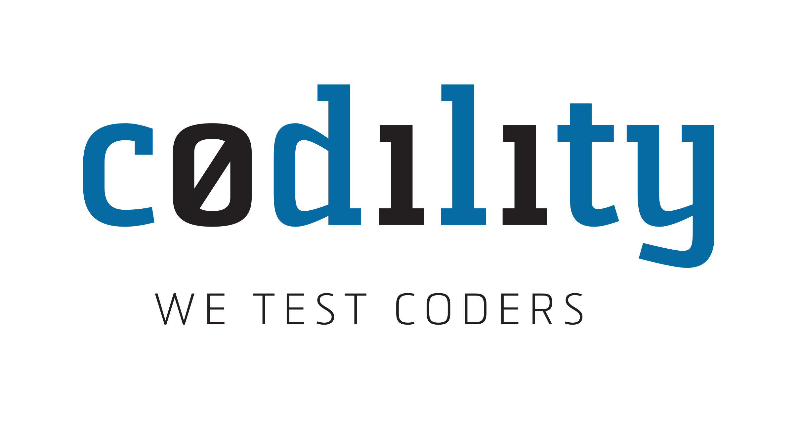

	

	

    Solutions to the programming problems

	If you are interested in making a solution sheet or have a better solution or in a different language, feel free to make a pull request.

	
	
	

# Hackerrank
## 1. Algorithms
### Dynamic Programming
| #  | Title           |  Solution       |  Time           | Space           | Difficulty    | Points          | Note
-----|---------------- |:---------------:| --------------- | --------------- |:-------------:|:---------------:| -----
|  |[Stock Maximize](https://www.hackerrank.com/challenges/stockmax)| [Python](hackerrank/stock-maximize/solution.py), [Swift](hackerrank/stock-maximize/solution.swift) | _O(n)_ | _O(n)_ | Medium | 50 | ||

### Graph Theory
| #  | Title           |  Solution       |  Time           | Space           | Difficulty    | Points          | Note
-----|---------------- |:---------------:| --------------- | --------------- |:-------------:|:---------------:| -----
|  |[Roads and Libraries](https://www.hackerrank.com/challenges/torque-and-development)| Python | | | Medium | 10 | ||

### NP Complete
| #  | Title           |  Solution       |  Time           | Space           | Difficulty    | Points          | Note
-----|---------------- |:---------------:| --------------- | --------------- |:-------------:|:---------------:| -----
|  |[Walking the Approximate Longest Path](https://www.hackerrank.com/challenges/walking-the-approximate-longest-path)| Python | | | Hard | 10 | ||
|  |[Sam's Puzzle](https://www.hackerrank.com/challenges/sams-puzzle)| Python | | | Advanced | 10 | ||

## 2. Data Structure 
### Arrays
| #  | Title           |  Solution       |  Time           | Space           | Difficulty    | Points          | Note
-----|---------------- |:---------------:| --------------- | --------------- |:-------------:|:---------------:| -----
|  |[2D Array](https://www.hackerrank.com/challenges/2d-array)| [Python](hackerrank/2d-array/solution.py), [Swift](hackerrank/2d-array/solution.swift) | _O(n)_ | _O(n)_ | Easy | 15 | ||
|  |[Dynamic Array](https://www.hackerrank.com/challenges/dynamic-array)| [Python](hackerrank/dynamic-array/solution.py) | _O(n)_ | _O(n)_ | Easy | 15 | ||

### Linked Lists 
| #  | Title           |  Solution       |  Time           | Space           | Difficulty    | Points          | Note
-----|---------------- |:---------------:| --------------- | --------------- |:-------------:|:---------------:| -----
|  |[Print the Elements of a Linked List](https://www.hackerrank.com/challenges/print-the-elements-of-a-linked-list)| [Python](hackerrank/print-the-elements-of-a-linked-list/solution.py) | | | Easy | 5 | ||

# Codility
## 1. Iterations
### Dynamic Programming
| #  | Title           |  Solution       |  Time           | Space           | Difficulty    | Points          | Note
-----|---------------- |:---------------:| --------------- | --------------- |:-------------:|:---------------:| -----
|  |[Binary Gap](https://codility.com/c/run/trainingBVEWHG-T8K)| [Python](codility/binary-gap/solution.py), [Swift](codility/binary-gap/solution.swift) | _O(log(n))_ | _O(log(n))_ | Medium | 50 | ||

# ETC
| #  | Title           |  Solution       |  Time           | Space           | Difficulty    | Note
-----|---------------- |:---------------:| --------------- | --------------- |:-------------:| -----
|  |[Skiing in Singapore](https://www.hackerrank.com/challenges/2d-array)| [Python](etc/skiing-in-singapore.ipynb) | | | | ||
